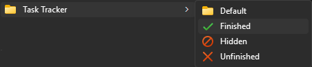
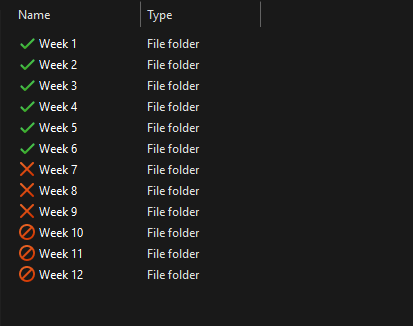

# TaskTracker
TaskTracker is a lightweight tool for Windows 10 and 11 that adds task status options to the right-click context menu of folders.<br>
Easily mark folders as Finished, Hidden, Unfinished, or reset them to the Default icon.<br>
⚠️ Icon changes may not appear immediately due to Windows icon cache.<br>

## Features
* Add or remove task status options from the right-click menu
* Simple install/uninstall using a single installer
* Instantly mark folder icons with one of four states: 📁 Default ✅ Finished 🚫 Hidden ❌ Unfinished

## Preview
### Context Menu


### Folder Tracking Example


## Installation
Download the latest installer from the [Releases](https://github.com/Masonlet/TaskTracker/releases) page and run it.  
To uninstall, simply re-run the installer.

## Building the Project
To build TaskTracker and Installer from source using CMake:

### 1. Clone the Repository
```bash
git clone https://github.com/Masonlet/TaskTracker.git
cd TaskTracker
```

### 2. Create a Build Directory and Generate Build Files
```bash
mkdir build
cd build 
cmake ..
```

### 3. Build the Project
```bash
cmake --build .
```
Or open the generated `.sln` file in Visual Studio and build the solution.
